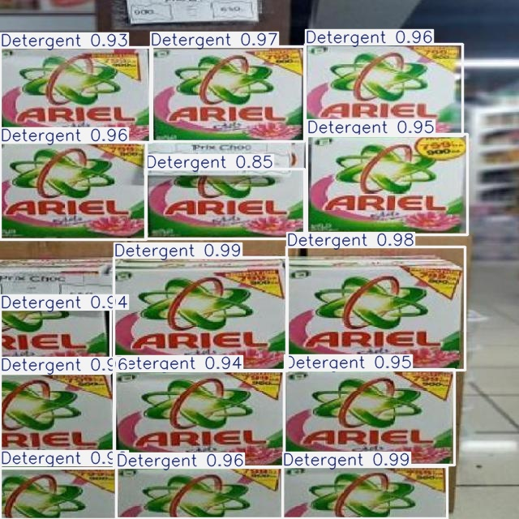

# Retail Shelf Product Detection with YOLOv8 

## Proje Özeti
Bu proje, perakende sektöründe **raf düzeni (Planogram compliance)** ve **stok takibi (On-shelf availability)** problemlerini çözmek için geliştirilmiştir. Vispera gibi şirketlerin görüntü işleme teknolojileri referans alınarak, gerçek market verileri üzerinde **YOLOv8** modeli eğitilmiştir.

## Teknik Detaylar
* **Model:** YOLOv8 Nano (Transfer Learning)
* **Eğitim:** Google Colab (T4 GPU)
* **Veri Seti:** Roboflow (Market Ürünleri)
* **Kütüphaneler:** Ultralytics, OpenCV, Python

## Sonuç
Model, market raflarındaki karmaşık ve bitişik ürünleri başarıyla tespit edebilmektedir.

